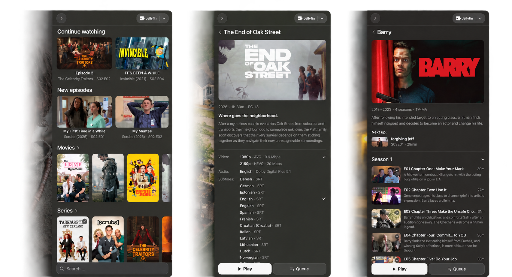

# Jellyfin IINA Plugin

Plugin for accessing Movies and TV series from your Jellyfin server in IINA. Displays a simplified view of your library that lets you browse and play items right from IINA. **Not affiliated with the official Jellyfin Project.**

## Requirements

- Jellyfin 12
- IINA 1.5
- HTTPS connection to your Jellyfin server

## Installation

1. In IINA, open Settings > Plugins.
2. Select Install from GitHub.
3. Enter `ada-bee/jellyfin-iina`
4. Restart IINA if it does not appear immediately.
5. (Optional) Configure the plugin in IINA Settings.

## Features

- Browse movie and TV libraries. Music is not supported.
- Multiple versions and track selection.
- Direct play. Transcoding support is TBA.
- Playback reporting and resume.
- Automatic playback of the next episode.
- Intro and credits skipping with overlay buttons.

## Screenshots

## Attribution

Includes logos and icons licensed under [CC-BY-SA-4.0](https://creativecommons.org/licenses/by-sa/4.0/) by the [Jellyfin Project](https://github.com/jellyfin/jellyfin-ux).
